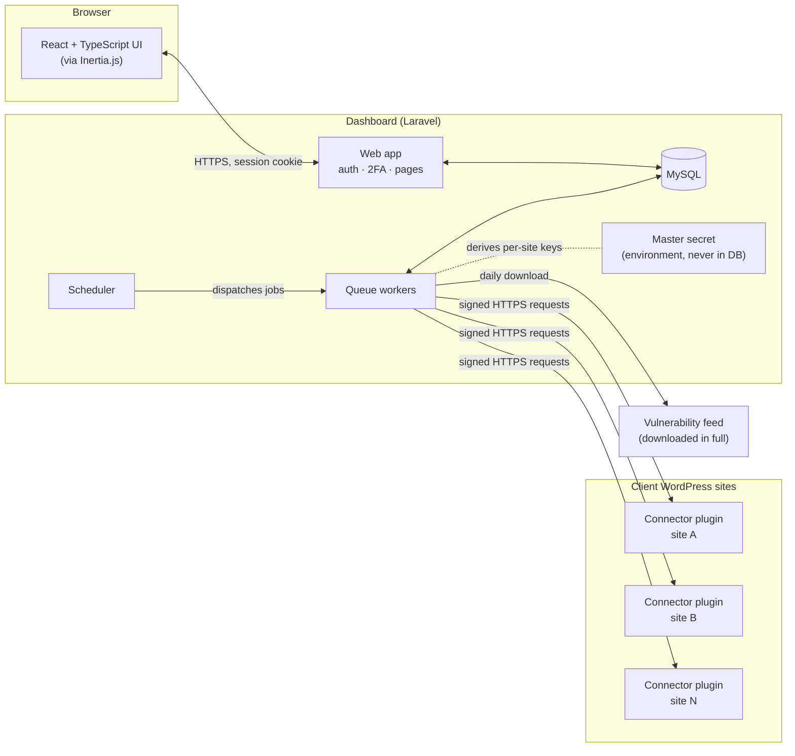
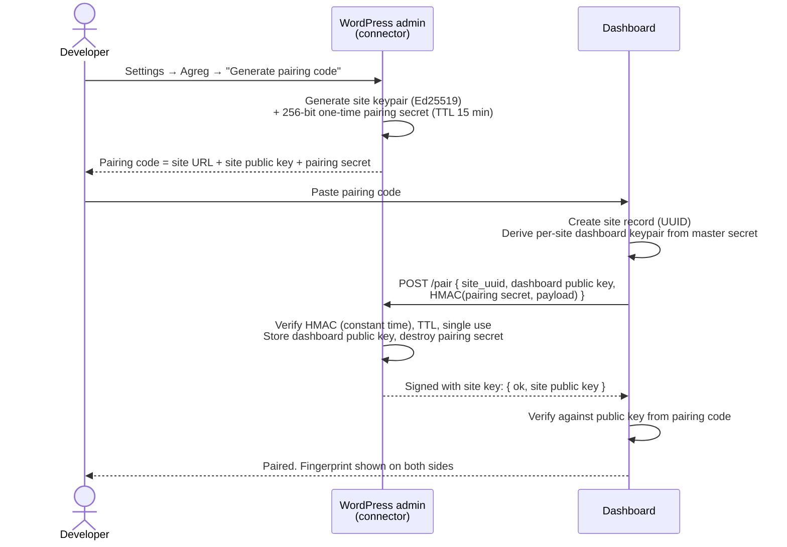
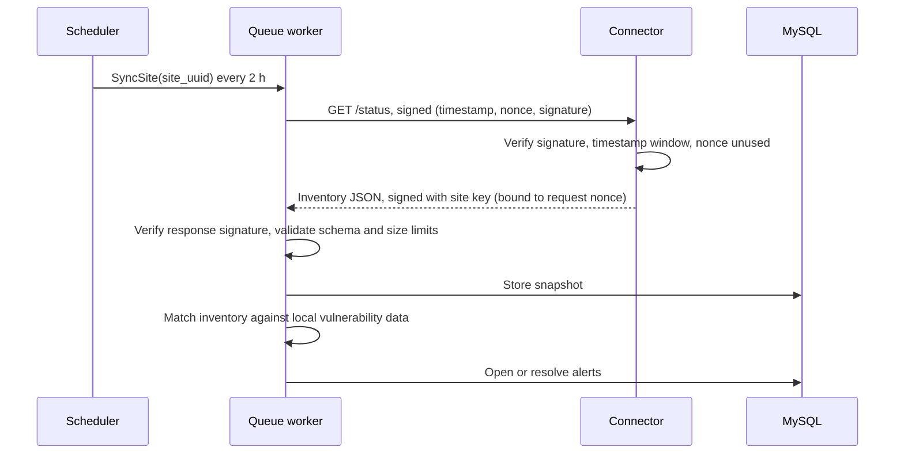
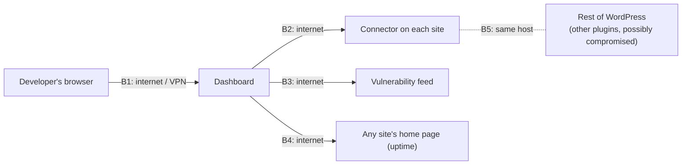

# Agreg

> **Status: design phase, draft v0.1.** This document describes the intended architecture and threat model. No code has been written yet. It is meant to be challenged and iterated on before implementation starts.

**Agreg is a self-hosted dashboard for developers who maintain several WordPress sites.** Open it in the morning and see at a glance what needs attention across every site you look after: pending updates, known vulnerabilities, outdated PHP, expiring certificates, sites that are down, comments waiting for moderation. If everything is green, you're done. If not, you address issues one by one.

*Agreg is a working title.*

---

## Table of contents

1. [Why this project](#1-why-this-project)
2. [Scope of v1](#2-scope-of-v1)
3. [Architecture](#3-architecture)
4. [Key flows](#4-key-flows)
5. [Connector protocol](#5-connector-protocol)
6. [Threat model](#6-threat-model)
7. [Architecture decision records](#7-architecture-decision-records)
8. [Tech stack](#8-tech-stack)
9. [Open questions](#9-open-questions)

---

## 1. Why this project

A freelance developer or small agency typically maintains a handful to a few hundred WordPress sites, often on different hosts (OVH, Hostinger, o2switch, managed WordPress hosting…), with different PHP versions and plugin sets. Checking each admin panel one by one doesn't scale, and the important signals get missed: *"this plugin on 3 of your sites has a known vulnerability"* is exactly the kind of information nobody sees until it's too late.

Commercial tools exist (ManageWP, MainWP, WP Umbrella…). Agreg takes a deliberately different stance:

- **Security first.** The dashboard never stores WordPress credentials, and in v1 it is **read-only by design**: the connector does not expose a single endpoint that can modify a site.
- **Privacy first.** The list of plugins installed on client sites is never sent to a third party. Vulnerability matching happens locally.
- **Self-hosted and minimal.** One Laravel application and one dependency-free WordPress plugin. The dashboard does not even need to be reachable from the internet (see [ADR-002](#adr-002-pull-model-the-dashboard-polls-sites)).

## 2. Scope of v1

### In scope

| Signal | Source | Default frequency |
|---|---|---|
| WordPress core version and available update | Connector | every 2 h |
| Plugin and theme versions, available updates | Connector | every 2 h |
| PHP and MySQL/MariaDB versions | Connector | every 2 h |
| Site Health status (WordPress' built-in checks) | Connector | every 2 h |
| Number of comments pending moderation (count only) | Connector | every 2 h |
| Vulnerability feed | Downloaded in full | daily |
| **Known vulnerabilities in installed plugins, themes and core** | Local match against the downloaded feed | after every sync (every 2 h) and after each feed refresh |
| Uptime (HTTP status, response time) | Dashboard probe, no connector involved | every 5 min |
| TLS certificate expiry | Dashboard probe | daily |
| "Refresh now" on demand | Connector | manual |

Alerts are shown in the dashboard. An optional daily email digest is still an open question (see [§9](#9-open-questions)).

### Explicitly out of scope for v1

- **Any write action** on sites: running updates, moderating comments, installing plugins. This is a v2 topic and will require its own threat model update.
- Backups, staging, deployments, SEO, analytics.
- Multi-tenancy (several organizations sharing one instance). v1 is single-tenant: one team, one instance.
- Public self-registration. Accounts are created from the command line.

## 3. Architecture



### Components

**Dashboard (Laravel + Inertia + React).** Runs on the developer's own server, or locally.
- *Web app*: authentication (password + mandatory TOTP 2FA), site list, alerts, site detail pages. Inertia.js lets React render the pages while Laravel keeps control of routing, sessions and CSRF protection, so there is no separate public API and no token stored in the browser.
- *Scheduler*: Laravel's task scheduler decides when each check is due.
- *Queue workers*: each check (sync site X, probe site Y, refresh feed) is an isolated job with timeouts and retries. Sites are processed in parallel, so one slow host doesn't block the others. This is what lets the same design go from 6 sites to several hundred.
- *MySQL*: sites, inventory snapshots, alerts, audit log. **No WordPress credentials, no private keys** (see [§5.1](#51-keys)).

**Connector plugin (WordPress, PHP 7.4+).** Installed on each managed site.
- Zero Composer dependencies. It relies only on WordPress core APIs, including `sodium_compat`, which WordPress has shipped since 5.2 so Ed25519 works even when the host's PHP lacks `ext-sodium`.
- Exposes **two** REST routes, both hidden from the REST index: `pair` and `status`. Nothing else.
- Read-only: it reads versions, update transients, Site Health results and comment counts. It never writes anything except its own options (keys, nonce cache).
- Cleans up after itself: `uninstall.php` deletes every option and transient it created.

**Shared protocol package (`packages/protocol`).** The single implementation of the wire protocol: key derivation, canonical strings, signing, verification, pairing proof. Both the dashboard and the connector use it, so the two sides can never drift apart (see [ADR-010](#adr-010-one-shared-protocol-package)).

**Vulnerability feed.** Downloaded in full once a day and stored locally. Matching installed versions against known vulnerabilities is a pure local computation (see [ADR-005](#adr-005-vulnerability-matching-is-done-locally)).

### Code organization

Business rules live in plain PHP, independent of the framework. Laravel and WordPress are delivery mechanisms around them. The rigor is applied where the logic is critical, not uniformly (see [ADR-009](#adr-009-pragmatic-layered-architecture)).

```
dashboard/app/
├── Domain/          Pure PHP, no Laravel: Fleet, Alerting, Vulnerability, Security (SSRF policy)
├── Application/     Use cases (PairSite, SyncSite, ProbeUptime…) and the ports they need
├── Infrastructure/  Laravel adapters: Eloquent repositories, HTTP client, jobs, console
└── Http/            Thin controllers and Inertia pages; read-only screens query directly

connector/src/
├── Domain/          Inventory assembly, request verification rules
├── Port/            Interfaces over WordPress (environment, options, clock)
├── WordPress/       Adapters calling WordPress functions
└── Entry/           REST routes and admin screen

packages/protocol/   Wire protocol, PHP 7.4, no dependencies
```

Dependencies point inward only: `Http`/`Infrastructure` → `Application` → `Domain`. Architecture tests enforce this in CI.

## 4. Key flows

### 4.1 Pairing a site

Pairing establishes mutual trust between the dashboard and a site without any password ever crossing the wire or being stored.



Properties:
- The pairing secret is single-use, expires after 15 minutes, and failed attempts are rate-limited.
- Both sides display the same short fingerprint of the key pair, so the developer can visually confirm that no one swapped keys in transit.
- Re-pairing a site replaces its keys. Clicking "Disconnect" in the WordPress admin deletes them immediately, which revokes the dashboard's access from the site side.

### 4.2 Periodic sync



### 4.3 Uptime and TLS probe

The dashboard sends a plain HTTPS `GET` to the site's home URL. The connector is not involved, so the probe still works when WordPress itself is broken (fatal error, database down). A site is reported **down** after 2 consecutive failures, to avoid false alarms from a single network hiccup. The TLS certificate's expiry date is read from the same handshake.

### 4.4 Vulnerability matching

1. Once a day, a job downloads the full vulnerability feed over HTTPS.
2. The feed is validated: expected schema, and a sanity check that rejects it if it suddenly shrinks by more than a set threshold, a sign of corruption or tampering.
3. Each installed component (`type`, `slug`, `version`) is matched against the affected version ranges.
4. The result is an alert such as: *"WPForms 1.8.x is installed on 3 sites and is affected by CVE-XXXX-YYYY (CVSS 8.1). Fixed in 1.8.z."*

Known limitation: premium or custom plugins that are not listed on wordpress.org can share a slug with an unrelated public plugin. Matches on components the connector reports as *not from wordpress.org* are flagged as "low confidence".

## 5. Connector protocol

### 5.1 Keys

| Key | Where it lives | Purpose |
|---|---|---|
| **Master secret** (256-bit) | Dashboard environment variable only. Never in the DB, never in logs | Root from which every per-site dashboard key is derived |
| **Per-site dashboard keypair** (Ed25519) | Derived on demand: `seed = HKDF-SHA256(master, info = "agreg/v1/site-key" ‖ site_uuid ‖ key_version)`. Never stored | Signs requests to one specific site |
| **Dashboard public key** for a site | Site's `wp_options` | Lets the connector verify requests |
| **Site keypair** (Ed25519) | Site's `wp_options` | Signs responses, so the dashboard knows the data really comes from the paired connector |
| **Site public key** | Dashboard DB (public, not sensitive) | Verifies responses |

Why derived keys? The database holds **no private key material at all**, yet every site has its own key. Rotating one site's key means incrementing its `key_version` and re-pairing. Rotating the master secret requires re-pairing every site, which is acceptable for an event that should only happen after a compromise. See [ADR-003](#adr-003-ed25519-signatures-with-per-site-keys-derived-via-hkdf).

### 5.2 Signed requests

Every request from the dashboard carries:

```
X-Agreg-Site:       <site_uuid>
X-Agreg-Key-Version:<key_version>
X-Agreg-Timestamp:  <unix seconds>
X-Agreg-Nonce:      <128-bit random, base64url>
X-Agreg-Signature:  Ed25519( canonical string )
```

The canonical string binds the signature to everything that matters:

```
AGREG-V1
<HTTP method>
<site_uuid>
<host as paired>
<request path>
<timestamp>
<nonce>
<SHA-256 of body>
```

The connector rejects the request, with the same generic `401` and no detail, if:
- any header is missing or malformed;
- the timestamp is more than ±300 s away from the site's clock;
- the nonce has already been seen within the window (nonces are cached for 10 minutes);
- the signature doesn't verify.

Repeated failures from one IP are throttled. If the host's clock drifts, the dashboard reports *"clock skew suspected"* instead of a generic failure, a common issue on cheap shared hosting.

### 5.3 Signed responses

The connector signs `AGREG-V1-RESPONSE ‖ request nonce ‖ SHA-256(body)` with the site key. Binding the response to the request nonce prevents an attacker from replaying an old, harmless-looking inventory to hide a newly installed vulnerable plugin.

### 5.4 Transport

HTTPS is **required**. A site without valid HTTPS cannot be paired. That fact itself is shown as an issue in the dashboard. Signatures already guarantee integrity, but without TLS the site inventory (a map of its weaknesses) would travel in clear text.

### 5.5 What the connector returns

```jsonc
{
  "schema": 1,
  "generated_at": 1760000000,
  "core":    { "version": "6.6.2", "update": "6.8.1" },
  "php":     { "version": "7.4.33" },
  "db":      { "server": "mariadb", "version": "10.6.18" },
  "plugins": [ { "slug": "wpforms-lite", "version": "1.8.4", "update": "1.9.2", "active": true, "origin": "wordpress.org" } ],
  "themes":  [ { "slug": "astra", "version": "4.6.0", "update": null, "active": true, "origin": "wordpress.org" } ],
  "site_health": { "good": 15, "recommended": 3, "critical": 1, "critical_tests": ["https_status"] },
  "comments": { "pending": 4 }
}
```

**Data minimization:** comment counts only, never comment content, author names or e-mail addresses. Agreg processes no personal data from the managed sites, which keeps it simple under GDPR.

## 6. Threat model

### 6.1 Assets

| Asset | Why it matters |
|---|---|
| **A1** Managed WordPress sites | The real target. Possibly sensitive client sites |
| **A2** Inventories | A list of outdated, vulnerable components is an attacker's shopping list |
| **A3** Master secret | Grants *read* access to every site's inventory |
| **A4** Dashboard accounts | Grant access to A2 and to configuration |
| **A5** Alert integrity | A hidden alert is as bad as a breach: the developer believes everything is fine |

### 6.2 Trust boundaries



### 6.3 Threats and mitigations

| # | Threat | Boundary | Mitigation | Residual risk |
|---|---|---|---|---|
| T1 | **Dashboard database leaked** (SQL dump, stolen backup) | — | No credentials or private keys in DB. Passwords hashed with bcrypt or Argon2id. TOTP secrets encrypted at rest | Inventories (A2) are exposed. Encrypted backups are recommended |
| T2 | **Master secret leaked** | — | Environment only, never logged, documented rotation procedure. **v1 is read-only**, so the worst case is reading inventories, never modifying a site | Inventory disclosure until rotation |
| T3 | **Dashboard account takeover** | B1 | Mandatory TOTP 2FA, login rate limiting, secure/HttpOnly/SameSite cookies, session regeneration on login, no self-registration | Phishing of both factors |
| T4 | **Forged request to a connector** | B2 | Ed25519 signature over method, host, path, body, timestamp, nonce | — |
| T5 | **Replay of a captured request** | B2 | ±300 s window and nonce cache | — |
| T6 | **Man-in-the-middle** | B2 | Mandatory HTTPS and signed responses bound to the request nonce | — |
| T7 | **Replay of an old response** to hide a new vulnerability | B2 | Response signature includes the request nonce | — |
| T8 | **Malicious or compromised site** sends crafted data (XSS in a plugin name, huge payloads, deep JSON) | B2 | Strict schema validation, size and depth limits, allow-listed characters for slugs and versions, React escaping, no `dangerouslySetInnerHTML`, CSP headers | — |
| T9 | **SSRF**: the dashboard is tricked into calling internal addresses (cloud metadata `169.254.169.254`, `localhost`, the LAN) through a site URL | B2, B4 | DNS resolved once and pinned. Private, loopback and link-local ranges blocked, redirects not followed, strict timeouts and response size cap. Opt-in exception flag for the local Docker demo only | — |
| T10 | **Pairing code intercepted** | Out of band | Single use, 15 min TTL, rate-limited, fingerprint check on both sides | A code leaked *and* used within 15 min. The developer would see an unknown pairing |
| T11 | **Connector probed by anonymous scanners** | B2 | Routes hidden from the REST index, identical generic `401` on every failure, no version disclosure, per-IP throttling | The plugin's presence can still be guessed from its files on disk |
| T12 | **Another plugin on the same site is compromised** | B5 | Out of our control: a compromised WordPress can read our options. The site key only proves "this is the paired site", so a compromised site can only lie about *itself* | Accepted |
| T13 | **Tampered or corrupted vulnerability feed** | B3 | HTTPS, schema validation, shrink-threshold sanity check, last good copy kept on failure | Upstream provider compromise |
| T14 | **Silent failure**: a site stops reporting and alerts disappear | — | A site that missed 2 syncs in a row raises a *"not reporting"* alert. Data age is always displayed. Missing data is never treated as "all good" | — |
| T15 | **Secrets in logs** | — | Log redaction for signature headers, pairing codes and keys. Audit log records *who did what and when*, never payloads | — |
| T16 | **Supply chain** (Composer or npm packages) | — | Lockfiles committed, `composer audit` and `npm audit` in CI, minimal dependencies. The connector has zero dependencies | — |
| T17 | **Abuse of the public demo** | — | Separate deployment, fake sites on an isolated network, demo accounts read-only, nightly reset, outbound calls restricted to the demo network | — |
| T18 | **Timing attacks** on secret comparisons | B2 | `hash_equals` and libsodium constant-time functions everywhere | — |

### 6.4 Non-goals

- Protecting a site whose WordPress is already compromised. Agreg can *flag* risks, but it is not a security plugin or a firewall.
- Uptime monitoring from multiple geographic regions (v1 probes from a single location).

## 7. Architecture decision records

Short version here. Each will get its own file in `docs/adr/` once the design stabilizes.

#### ADR-001: Laravel + Inertia + React
Laravel provides the scheduler, queues, encryption and authentication out of the box. Inertia keeps a single application with server-side sessions: no separate API, no browser-stored tokens, a smaller attack surface. React + TypeScript gives a responsive UI. *Rejected:* separate SPA + REST API (more surface for no gain in v1), Astro (designed for content sites, not authenticated applications).

#### ADR-002: Pull model, the dashboard polls sites
The dashboard controls timing, doesn't depend on WP-Cron (which only runs when the site receives traffic), and **needs no inbound endpoint**: it can run on a laptop or behind a VPN. *Trade-off:* the dashboard must reach every site over the internet.

#### ADR-003: Ed25519 signatures with per-site keys derived via HKDF
Ed25519 is fast, has small keys, and is available on every supported host via WordPress' bundled `sodium_compat`. HKDF derivation gives one key per site with zero private keys in the database. *Rejected:* WordPress Application Passwords (they would mean storing admin-level credentials centrally), shared HMAC secrets (they would have to be stored on both sides).

#### ADR-004: v1 is strictly read-only
The safest endpoint is the one that doesn't exist. A leaked master secret or a dashboard compromise cannot modify any site. Write actions are deferred to v2, with their own threat model (scoped capabilities, per-site opt-in, confirmation, audit).

#### ADR-005: Vulnerability matching is done locally
Querying a third-party API per site would hand it the plugin inventory of every client, which is exactly the data we want to protect. Downloading the full feed costs a bit of bandwidth and keeps that data private.

#### ADR-006: MySQL
Familiar, available everywhere, fully supported by Laravel. Nothing in this workload needs PostgreSQL-specific features.

#### ADR-007: Connector supports PHP 7.4+
Real-world maintenance means inheriting neglected hosts. A monitoring tool that can't be installed on the sites that need it most is useless. The dashboard itself targets the current PHP 8.x.

#### ADR-008: Polling cadence
Updates and inventories change slowly, so every 2 h with an on-demand refresh. Downtime matters within minutes, so uptime runs every 5 min. Certificates expire over weeks, so daily.

#### ADR-009: Pragmatic layered architecture
**Context:** this codebase has a small, critical core (wire protocol, version-range matching, alert rules, SSRF policy, inventory validation) and a lot of plain CRUD around it (screens, settings, audit log).

**Decision:**
- **Domain** holds the critical rules as plain PHP: immutable value objects and pure services, no framework classes. It may depend on `packages/protocol` and nothing else.
- **Application** holds one class per use case (`PairSite`, `SyncSite`, `ProbeUptime`, `RefreshVulnerabilityFeed`…). It declares the ports it needs (`SiteRepository`, `ConnectorClient`, `Clock`…) as interfaces.
- **Infrastructure** implements those ports with Laravel: Eloquent models and repositories, the SSRF-safe HTTP client, queue jobs, console commands. Eloquent models never leave this layer through the write path.
- **Http** holds thin controllers. **Commands go through use cases. Read-only screens query the database directly** through dedicated query classes, with no mapping into domain objects just to display a table.
- The dependency rule is enforced by **architecture tests in CI**, not by convention alone.
- The connector follows the same idea at a smaller scale: WordPress functions are wrapped behind ports, so collectors and verification logic are unit-tested without loading WordPress.

**Rejected:**
- *Full Clean Architecture everywhere.* Mapping every screen through entities, repositories and presenters triples the code for CRUD that has no business rules. It is harder to read, not safer.
- *Plain Laravel MVC.* Protocol and matching rules would end up in models and controllers, coupled to the framework and hard to test in isolation.

#### ADR-010: One shared protocol package
**Context:** the dashboard signs and the connector verifies, and vice versa for responses. Two implementations of the same canonical string will eventually drift, and a one-byte difference breaks every signature.

**Decision:** `packages/protocol` (namespace `Agreg\Protocol`) is the only implementation of the protocol.
- PHP 7.4 syntax, no dependencies. It uses `hash_hkdf`, `hash_hmac` and the `sodium_*` functions: native `ext-sodium` on the dashboard, WordPress' bundled `sodium_compat` in the connector.
- The dashboard consumes it through a Composer path repository.
- The connector gets a build-time copy in `connector/lib/protocol/`, and a CI check verifies the copy is identical to the source. This keeps the plugin free of runtime dependencies (rule: no Composer in the connector).
- `docs/test-vectors.json` is generated from the package and committed. Any change to the vectors is a protocol change and requires a version bump.

**Rejected:**
- *Two independent implementations* (drift risk, double the security review).
- *Composer dependency inside the plugin.* WordPress plugins that bundle the same library at different versions conflict at runtime.

## 8. Tech stack

| Layer | Choice |
|---|---|
| Dashboard back end | PHP 8.3+, Laravel (latest stable) |
| Dashboard front end | React, TypeScript, Inertia.js, Vite, Tailwind CSS |
| Database | MySQL 8 |
| Queue | Laravel database driver (Redis only if needed) |
| Connector | WordPress plugin, PHP 7.4 – 8.x, no dependencies, WordPress Coding Standards |
| Shared protocol | `packages/protocol`, PHP 7.4, no dependencies |
| Architecture tests | Pest `arch()` rules enforcing the layer dependencies |
| Crypto | libsodium (Ed25519), HKDF-SHA256, HMAC-SHA256 |
| Tests | Pest/PHPUnit (dashboard), PHPUnit + WP test suite (connector), Vitest (front end) |
| Dev and demo | Docker Compose: dashboard + MySQL + 3 demo WordPress sites on different PHP versions |
| CI | GitHub Actions: tests, static analysis (PHPStan/Larastan), coding standards, dependency audit |

## 9. Open questions

- [ ] **Vulnerability feed provider**: Wordfence Intelligence (free with API key, attribution required) vs. alternatives. Verify license terms for a public demo.
- [ ] **Minimum WordPress version** for the connector (5.6? 6.0?).
- [ ] **Email digest** in v1, or in-app only?
- [ ] **Optional IP allow-list** on the connector (accept requests only from the dashboard's IP)?
- [ ] **Encrypt inventories at rest** in the DB, or rely on encrypted backups and DB access control? (see T1)
- [ ] **Final project name.**

## License

- **Dashboard, shared protocol package, docs:** [MIT](LICENSE).
- **Connector plugin:** GPL-2.0-or-later, as required for code that integrates with WordPress. The MIT-licensed protocol package can be bundled into it.
